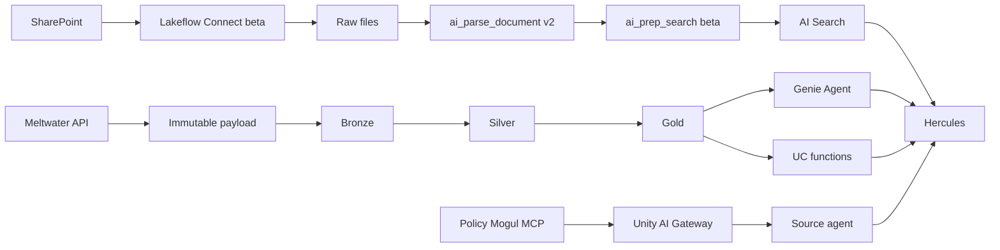

# Architecture

## Boundaries

Hercules is the orchestrator-facing boundary. Databricks adapters return normalized `Evidence`
records with stable source identifiers; Hercules assigns request-local `[S#]` citation IDs.
Retrieved text is untrusted data and never becomes instructions.

## Resource lifecycle

The base bundle creates durable parent resources: the `data` catalog, source schemas, volumes,
registered model names, AI Search endpoint, and jobs. `prevent_destroy` protects the catalog.

Child resources with runtime prerequisites are opt-in templates:

- A Delta Sync index is enabled only after its source table and Change Data Feed exist.
- A Genie Agent is enabled only after gold tables and a SQL warehouse exist.
- Serving endpoints are enabled only after a model version has been registered and promoted.

This two-phase deployment prevents first-deploy references to nonexistent tables and models.

## Compute

- SharePoint AI functions use serverless environment version 3 or later. `ai_prep_search`
  additionally requires a workspace/runtime that supports DBR 18.2 behavior.
- Non-AI transforms use a reusable standard-access Photon job cluster.
- Jobs are paused by default where upstream beta/MCP dependencies require workspace approval.

## Governance

Authentication uses GitHub OIDC workload identity federation. Runtime API secrets belong in a
Databricks secret scope or managed OAuth connection, never source YAML. Each source owns a UC
schema, volumes, tables, functions, indexes, models, lineage, and grants. External MCP content
stays external unless an explicit latency, resilience, retention, or audit requirement justifies
materialization.

The Policy Mogul health job validates that its Unity Catalog connection is visible to the job
identity. Tool discovery and invocation occur inside the promoted source-agent model. The project
does not install `databricks-mcp` directly while its current MLflow dependency excludes the
advisory-fixed `cryptography` release.

AI Search resource provisioning uses the authenticated Databricks SDK REST client rather than the
current `databricks-ai-search` package for the same reason. Retrieval remains behind the typed
`IndexLike` protocol, allowing a workspace-owned client to be injected without coupling Hercules
to that package.