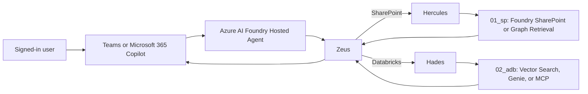

# Olympus Copilot SDK

Olympus is a governed, retrieval-grounded agent architecture for Azure AI Foundry, Microsoft
Teams, and Microsoft 365 Copilot. Zeus is the sole hosted entry point. It routes requests to
Hercules for SharePoint evidence, Hades for Databricks evidence, or both, then synthesizes only
from authorized evidence with stable request-local citations.

## Architecture



- `src/olympus_copilot_sdk/foundry`: dependency-free hosted Zeus contract, deterministic routing,
  stages, denial behavior, evidence normalization, synthesis boundary, and citations.
- `src/olympus_copilot_sdk/channel`: Teams, Microsoft 365 Copilot, Foundry, OBO, consent, and
  restricted-document smoke-test configuration validation.
- `src/olympus_copilot_sdk/01_sp`: standalone SharePoint/Graph retrieval project. It forwards the
  caller's delegated identity and returns no evidence when source access is denied.
- `src/olympus_copilot_sdk/02_adb`: standalone Databricks project for Vector Search, Genie, or
  governed MCP under the `data.<source_schema>` Unity Catalog convention.
- `src/olympus_copilot_sdk/evaluation`: stack-neutral snapshots and deterministic quality metrics.
- `src/olympus_copilot_sdk/governance`: specialist receipt and AI registry validation.

Runtime capabilities stay package-owned in `tools.py`. Packages with several external operations
also maintain `tools.md`. There is no root tool registry.

## Security Boundaries

- Retrieved text, filenames, tool output, and specialist reports are untrusted data.
- SharePoint and Databricks remain the authorization authorities. Prompts and channel manifests do
  not grant access.
- OBO requests require a complete delegated caller identity. Tokens are redacted from string and
  representation output and are never passed to synthesis.
- A denied retrieval result cannot contain evidence, citations, metadata, or protected content.
- Placeholder configuration is valid only for static checks. It cannot be classified as
  authenticated evidence or promoted to an environment.
- Permissions, admin consent, channel publication, deployments, production identities, production
  data, dependencies, and governance changes require human approval.

## Configuration

Start with these placeholder artifacts:

- `src/olympus_copilot_sdk/channel/example_channel_config.json`
- `src/olympus_copilot_sdk/channel/example_teams_manifest.json`
- `src/olympus_copilot_sdk/channel/example_microsoft_365_copilot_manifest.json`
- `src/olympus_copilot_sdk/01_sp/configs/example.toml`
- `src/olympus_copilot_sdk/02_adb/configs/example.toml`

Values prefixed with `replace_me_` are intentionally unresolved. Do not commit credentials or
replace placeholders with production values without the required approval and secret-management
path.

## Local Validation

The root package has no runtime dependencies. Install only development tooling and run:

```bash
uv sync --extra dev --locked
uv run ruff format --check .
uv run ruff check .
uv run pyright
uv run pytest --cov-fail-under=70
uv run python -m olympus_copilot_sdk.governance.registry ai_registry
uv run bandit -c pyproject.toml -r src
uv run pip-audit
uv build
```

Validate the standalone cloud projects independently:

```bash
cd src/olympus_copilot_sdk/01_sp
uv sync --extra dev --locked
uv run pytest

cd ../02_adb
uv sync --extra dev --locked
uv run pytest
databricks bundle validate --target dev
```

The Databricks command requires the CLI, an authenticated workspace, approved resources, and an
environment identity. Local mocks do not establish cloud readiness.

## Smoke-Test Exit Criteria

1. Upload approved test PDFs to the configured SharePoint test library and preferred Azure AI
   Search path, or an approved Foundry file/vector store or Azure Blob source.
2. Deploy Zeus as a Foundry Hosted Agent and connect the approved Teams and Microsoft 365 Copilot
   manifests.
3. Verify OBO identity continuity with an authorized test user.
4. Verify a denied test user receives no restricted PDF title, filename, text, snippet, citation,
   metadata, cached answer, or download link.
5. Exercise Hades through the selected Databricks strategy and confirm normalized citations.
6. Record authenticated outcomes separately from static and mocked evidence.

Project-wide sign-off follows [the governance contract](docs/GOVERNANCE.md). Odin requires fresh
Loki, Thor, and Hela receipts and must preserve every condition.
