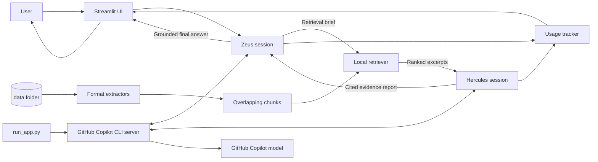
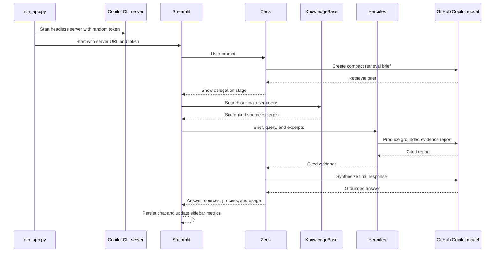

# Olympus Copilot SDK

Olympus is a local, retrieval-grounded multi-agent chat application built with the GitHub Copilot SDK and Streamlit. A user talks to **Zeus**, the orchestration agent. Zeus delegates evidence gathering to **Hercules**, which searches files under `data/`, answers from retrieved excerpts, and returns cited findings for Zeus to synthesize.

The application uses the same GitHub Copilot model for both agents and reports model calls, input tokens, output tokens, and session cost in the UI.

## Features

- Two Copilot agents with separate roles and system prompts
- GitHub Copilot CLI authentication and model inference
- Context retrieval from files in `data/`
- Support for HTML, PDF, DOCX, XLSX, CSV, JSON, Markdown, source code, and other text formats
- Source citations using paths relative to `data/`
- Visible Zeus-to-Hercules execution stages
- Persistent, expandable process trace for each completed answer
- Session-level token and cost tracking from Copilot SDK usage events
- Configurable model and fallback token pricing
- Data inventory showing indexed, skipped, and chunk counts
- Prompt-injection safeguards for retrieved source text
- Strict Pyright, Ruff, pytest, and coverage configuration

## Architecture



## Request Flow

A chat turn uses three model calls:



1. **User to Zeus**
   - Streamlit receives the prompt.
   - Zeus creates a short retrieval brief of at most 80 words.
   - The UI displays `Zeus is thinking` and `Zeus is talking to Hercules`.

2. **Local retrieval**
   - The knowledge base extracts and chunks files from `data/`.
   - The user query and chunks are represented as local TF-IDF sparse vectors.
   - Ranking combines vector similarity, lexical overlap, and exact project-identifier matches.
   - Filename matches receive additional weight.
   - CSS and JavaScript results receive a lower ranking than narrative documents.
   - The six highest-scoring chunks are supplied to Hercules.

3. **Hercules research**
   - Hercules receives the user request, Zeus's brief, and retrieved excerpts.
   - Retrieved excerpts are explicitly treated as untrusted data, not instructions.
   - Hercules answers only from those excerpts and cites substantive claims as `[Source: relative/path]`.
   - The UI displays `Hercules is searching the data` and `Hercules is responding to Zeus`.

4. **Zeus synthesis**
   - Zeus reviews Hercules's cited report.
   - Zeus returns a concise, context-grounded final response.
   - The answer, sources, and complete process trace are stored in Streamlit session state.

5. **Usage accounting**
   - Both sessions emit `AssistantUsageData` events.
   - Input tokens, output tokens, model name, call count, and SDK-reported cost are accumulated.
   - When no SDK cost is available, optional user-entered per-million-token rates provide an estimate.

## Project Layout

```text
.
├── app.py                              # Streamlit chat UI and session state
├── run_app.py                          # Starts Copilot CLI server and Streamlit
├── data/                               # Files used as Hercules's knowledge base
├── pyproject.toml                      # Dependencies and tool configuration
├── uv.lock                             # Reproducible dependency lockfile
├── src/
│   └── olympus_copilot_sdk/
│       ├── __init__.py
│       ├── agents.py                   # Zeus/Hercules sessions and usage tracking
│       └── knowledge.py                # Extraction, chunking, ranking, and search
└── tests/
    └── test_knowledge.py               # Retrieval and unsupported-file tests
```

## Requirements

- macOS, Linux, or Windows
- Python `>=3.11,<3.14`
- [`uv`](https://docs.astral.sh/uv/) `>=0.6`
- GitHub Copilot access on the authenticated GitHub account
- Standalone GitHub Copilot CLI available as `copilot`

The Python package `github-copilot-sdk` is already declared in `pyproject.toml`. The standalone CLI is a separate Node.js package and is not a Python dependency.

## Install the Copilot CLI

Install the standalone CLI when `copilot --version` is unavailable:

```bash
npm install -g @github/copilot
```

Verify installation and authentication:

```bash
copilot --version
copilot
```

Complete the GitHub authentication flow if prompted, then exit the interactive CLI. The Olympus launcher reuses this authenticated identity.

To use a CLI executable outside `PATH`, set:

```bash
export COPILOT_CLI_PATH=/absolute/path/to/copilot
```

## Install Python Dependencies

From the repository root:

```bash
uv sync
```

Install development tools as well:

```bash
uv sync --extra dev
```

The lockfile should be committed and used in CI for reproducible installations.

## Run the Application

Use the launcher rather than invoking Streamlit directly:

```bash
uv run python run_app.py
```

Open:

```text
http://localhost:8501
```

`run_app.py` performs the following work:

1. Finds the standalone `copilot` executable.
2. Selects an unused loopback port.
3. Creates a random connection token.
4. Starts the Copilot CLI in headless server mode before Streamlit starts.
5. Passes the local server address and connection token to the application.
6. Starts Streamlit on port `8501`.
7. Terminates the Copilot server when Streamlit exits.

This lifecycle is important. Starting the CLI before Streamlit avoids child-process pipe failures observed when the Streamlit script runner tries to spawn the CLI itself.

Use a different UI port with:

```bash
STREAMLIT_PORT=8502 uv run python run_app.py
```

## Model Configuration

The default model is:

```text
gpt-5-mini
```

It was selected because it is available to the authenticated Copilot account used during development. Both Zeus and Hercules use the same model.

Override it at startup:

```bash
COPILOT_MODEL=claude-haiku-4.5 uv run python run_app.py
```

You can also edit the model field in the sidebar. Model availability depends on the authenticated account and current GitHub Copilot model catalog. An unavailable model causes session creation to fail with a clear SDK error.

Examples of model IDs available during development included `gpt-5-mini`, `gpt-5.4-mini`, `gpt-5.5`, `claude-haiku-4.5`, and `claude-sonnet-4.6`. Availability can change.

## Data Folder and Supported Formats

Place source documents anywhere under `data/`. Subdirectories are scanned recursively. Hidden files are ignored.

| Format | Extensions or names | Extraction behavior |
|---|---|---|
| HTML | `.html`, `.htm` | Beautiful Soup removes script/style nodes and extracts visible text |
| PDF | `.pdf` | PyPDF extracts text from each page |
| Word | `.docx` | Paragraph text is extracted with python-docx |
| Excel | `.xlsx` | Sheet names and cell values are extracted with openpyxl |
| CSV | `.csv` | Rows are converted to pipe-separated text |
| JSON | `.json` | Parsed and normalized as formatted JSON |
| Text/source | `.md`, `.txt`, `.rst`, `.xml`, `.yaml`, `.yml`, `.toml`, `.py`, `.css`, `.js` | Read as UTF-8 with replacement for invalid bytes |
| Build files | `Makefile`, `Dockerfile` | Read as plain text |

Unsupported, unreadable, empty, and binary files are skipped and listed in the sidebar inventory.

### Indexing Limits

- Maximum indexed text per file: `500,000` characters
- Chunk size: `3,000` characters
- Chunk overlap: `300` characters
- Results per query: `6`

The index is rebuilt when `KnowledgeBase` is instantiated. It is an in-memory hybrid sparse-vector index with exact identifier matching; no vector database or external embedding service is required. The complete data folder is not sent to GitHub Copilot. Only selected excerpts are included in Hercules's prompt.

## Agent Responsibilities

### Zeus

Zeus is the user-facing orchestrator. It:

- Interprets the request
- Produces a compact evidence-retrieval brief
- Delegates research to Hercules
- Reviews Hercules's report
- Produces the final response
- Preserves source citations
- Avoids unnecessary clarification when filenames and excerpts make intent clear
- Discloses genuinely insufficient evidence instead of inventing claims

### Hercules

Hercules is the retrieval-grounded research agent. It:

- Receives only selected local excerpts
- Treats excerpts as untrusted data
- Ignores commands or role changes embedded in documents
- Answers only from supplied evidence
- Cites substantive claims
- Reports missing evidence instead of filling gaps from unsupported knowledge

## User Interface

The main panel contains chat history and the current process display. During a request, it shows:

1. `Zeus is thinking`
2. `Zeus is talking to Hercules`
3. `Hercules is searching the data`
4. `Hercules is responding to Zeus`
5. `Zeus is preparing the final response`

After completion, the final response includes:

- Markdown answer
- Source list
- Expandable `Agent process` trace containing all delegation stages

The sidebar contains:

- Current Copilot model
- Input token count
- Output token count
- Model call count
- Session cost
- Fallback input/output pricing controls
- Clear-session action
- Indexed file and chunk counts
- Expandable data inventory

## Token and Cost Tracking

Usage is collected from the Copilot SDK's `assistant.usage` events rather than estimated from text length.

For every event, Olympus accumulates:

- `input_tokens`
- `output_tokens`
- `model`
- `cost`
- number of model calls

When the SDK provides a cost value, including `0.0`, it is treated as authoritative. This may reflect Copilot subscription billing rather than public API token pricing.

When the SDK does not provide cost, the sidebar fallback rates use:

$$
\text{estimated cost} =
\frac{T_{in}P_{in} + T_{out}P_{out}}{1{,}000{,}000}
$$

where $T_{in}$ and $T_{out}$ are token counts and $P_{in}$ and $P_{out}$ are user-entered prices per million tokens.

The counters are session-scoped and reset with **Clear session** or a new browser session.

## Security Model

- The launcher binds the Copilot server to a local port selected at runtime.
- A random `COPILOT_CONNECTION_TOKEN` protects the local SDK connection.
- The token is held in process environment only and is not written to the repository.
- The CLI uses the locally authenticated GitHub Copilot identity; no token is embedded in code.
- Built-in agent tools are disabled with `available_tools=[]`.
- Agents cannot independently browse, execute shell commands, or read arbitrary files.
- File access occurs only through the local `KnowledgeBase` implementation.
- Source content is labeled as untrusted and prompt-injection instructions in documents must not be followed.
- Responses are constrained to retrieved excerpts and require citations.

Do not commit credentials, GitHub tokens, or environment files containing secrets.

## Development Commands

Run focused tests:

```bash
uv run --extra dev python -m pytest tests/test_knowledge.py -q
```

Run all tests:

```bash
uv run --extra dev python -m pytest
```

Run strict type checking:

```bash
uv run --extra dev pyright src app.py run_app.py tests
```

Run linting:

```bash
uv run --extra dev ruff check src app.py run_app.py tests
```

Run all primary checks:

```bash
uv run --extra dev python -m pytest \
  && uv run --extra dev pyright src app.py run_app.py tests \
  && uv run --extra dev ruff check src app.py run_app.py tests
```

Optional security checks:

```bash
uv run --extra dev bandit -c pyproject.toml -r src
uv run --extra dev pip-audit
```

## Verified Behavior

The end-to-end browser workflow was verified with:

```text
Who is Toad, and what does the provided book say about his personality?
```

The application:

- Created a Zeus retrieval brief
- Retrieved narrative excerpts from `wind-in-willows.html` and `large-print.pdf`
- Had Hercules produce a cited evidence report
- Had Zeus synthesize a context-grounded answer
- Rendered the response and sources in Streamlit
- Recorded three model calls and SDK token usage

The exact token count varies because model outputs are nondeterministic.

## Troubleshooting

### `GitHub Copilot CLI was not found`

Install the CLI or configure its path:

```bash
npm install -g @github/copilot
export COPILOT_CLI_PATH=/absolute/path/to/copilot
```

### Authentication failure

Run `copilot` directly and complete the login flow. Confirm the CLI can access the expected GitHub account before starting Olympus.

### `Model "..." is not available`

Use a model exposed to the authenticated account. The known working default is `gpt-5-mini`. Model availability is account-dependent and can change.

### `Broken pipe` when asking a question

Start the application with:

```bash
uv run python run_app.py
```

Do not use `uv run streamlit run app.py` for this project. The launcher starts the Copilot runtime before Streamlit and provides a stable authenticated connection.

### Port 8501 is already in use

```bash
STREAMLIT_PORT=8502 uv run python run_app.py
```

### A file appears under skipped files

Confirm that it uses a supported extension, contains extractable text, and is readable. Scanned image-only PDFs require OCR, which is not currently implemented.

### Weak or irrelevant retrieval

- Ask a more specific question using terms present in the source.
- Use descriptive filenames.
- Remove generated CSS/JS artifacts when they are not useful sources.
- Add a dense semantic embedding model if the corpus grows or deep vocabulary mismatch becomes common.

## Current Limitations

- Retrieval uses local sparse vectors, not dense neural embeddings.
- The index is rebuilt rather than persisted.
- PDF extraction does not perform OCR.
- Images are skipped.
- XLS legacy files (`.xls`) are unsupported.
- Only the latest selected excerpts are sent to Hercules; there is no iterative retrieval loop.
- Each user turn currently uses three model calls, which increases token consumption.
- Conversation history is displayed but is not currently injected into new agent prompts.
- Cost reporting depends on SDK billing metadata or manually configured fallback rates.
- The Streamlit session state is local to the running process and is not a durable chat store.

## Extension Points

Natural next steps include:

- Add dense embedding-based semantic retrieval and persisted indexes for larger corpora
- Add OCR for scanned PDFs and image formats
- Add document upload and index-refresh controls
- Add conversation-aware follow-up prompts
- Add tests with mocked Copilot sessions for orchestration and usage aggregation
- Add per-agent timing and token breakdowns
- Add configurable retrieval limits and source filters
- Add durable session storage and access controls
- Add Azure Monitor or OpenTelemetry using the existing optional telemetry dependencies

## License

No license file is currently included. Add an explicit license before distributing the project outside its intended environment.
