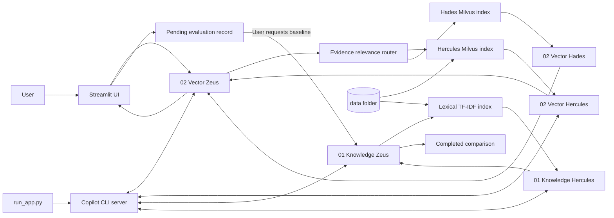
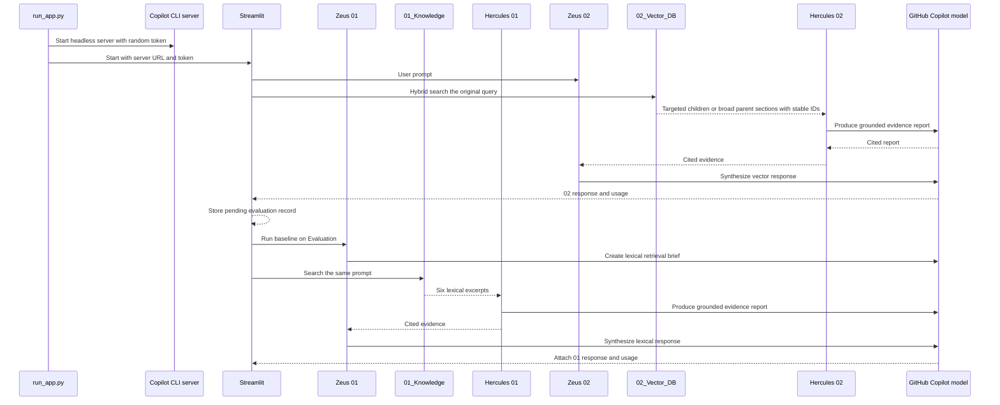

# Olympus Copilot SDK

Olympus is a local, retrieval-grounded multi-agent chat application built with the GitHub Copilot SDK and Streamlit. A user talks to **Zeus**, the orchestration agent. Deterministic evidence relevance routes each request to **Hercules** for `data/`, **Hades** for `data_2/`, or both; Zeus synthesizes only their cited findings.

The application uses the same GitHub Copilot model for both agents and reports model calls, input tokens, output tokens, and session cost in the UI.

## Features

- Three Copilot agents with separate roles and system prompts
- GitHub Copilot CLI authentication and model inference
- Independently persisted Milvus Lite indexes for `data/` and `data_2/`
- Local FastEmbed embeddings using `BAAI/bge-small-en-v1.5`
- On-demand lexical baseline evaluation using stored vector-chat prompts
- Response, source, token, latency, cost, and grounding-proxy comparison
- Support for HTML, PDF, DOCX, XLSX, CSV, JSON, Markdown, source code, and other text formats
- Stable excerpt citations (`[S1]`, `[S2]`, ...) mapped to source paths and unique locations
- Visible Zeus-to-specialist execution stages
- Session-level token and cost tracking from Copilot SDK usage events
- Configurable model and fallback token pricing
- Semantic chunk count in the Chatbot sidebar
- Prompt-injection safeguards for retrieved source text
- Strict Pyright, Ruff, pytest, and coverage configuration
- Typed Loki, Thor, and Hela review receipts with deterministic Odin precedence validation
- Machine-validated AI system registry with ownership, risk, control, retention, and evidence metadata
- Root CI across Python 3.11-3.13 plus CodeQL, dependency review, Dependabot, and CODEOWNERS

## Copilot Context Efficiency

Use [the Copilot context workflow](docs/COPILOT_CONTEXT.md) to keep chat scope small, attach files
and folders deliberately, compact or fork sessions, and preserve durable state in
[the rolling project checkpoint](docs/COPILOT_CHECKPOINT.md). The repository includes on-demand
`/checkpoint-session` and `/resume-project` prompts under `.github/prompts/`.

`.copilotignore` excludes generated state, local environments, build outputs, the large `data/`
corpus, and lockfiles on Copilot surfaces that support it. It is not a security boundary, and Agent
mode does not currently enforce GitHub content exclusion; managed exclusions belong in repository,
organization, or enterprise Copilot settings as documented in the workflow.

Project-wide deputy governance is defined in [the governance contract](docs/GOVERNANCE.md). Odin is
the only coordinator; Loki, Thor, and Hela return immutable evidence-backed receipts that are
rejected when missing, stale, malformed, or tied to changed artifacts. Agents may propose standards
updates, but humans retain approval authority for consequential governance and deployment changes.
The [AI registry](ai_registry/REGISTRY_README.md) inventories governed systems and control metadata;
it complements task-specific receipts and keeps sensitive operational evidence in approved external
systems.
Release versioning, SBOM, provenance, and rollback procedures are defined in
[the release guide](docs/RELEASE.md).

## Architecture



### Skills and Tools

Each numbered package owns a complete agent stack. Its `agents.py` owns lifecycle and usage,
`skills.py` owns bounded reasoning steps, `tools.py` owns model and retrieval operations,
`prompts.py` owns trust-aware prompt rendering, and `retrieval.py` owns package-local contracts.
There is intentionally no root agent, prompt, skill, tool, or retrieval implementation.

`.github/skills/` contains on-demand engineering workflows, not application runtime tools. Olympus
does not use `.github/tools/`; typed runtime capabilities stay in the owning numbered package's
`tools.py`. The `create-doc-capability` skill defines the governed path for future user-requested
Markdown, DOCX, or PDF downloads without granting Zeus unrestricted filesystem access.

### 01_Knowledge and 02_Vector_DB

Python package identifiers cannot begin with digits, so the requested numbered folders use the
import-safe names `knowledge_01` and `vector_db_02`. Their UI labels remain exactly
`01_Knowledge` and `02_Vector_DB`.

`01_Knowledge` is the complete original baseline application stack:

- Package-owned multi-format extraction
- 3,000-character chunks with 300-character overlap
- TF-IDF similarity, lexical overlap, filename weighting, and exact identifier boosts
- In-memory indexing with no model download or database

`02_Vector_DB` is the complete production application stack and owns:

- Paragraph- and sentence-aware child chunks capped at 800 characters with bounded overlap
- PDF page preservation and adjacent parent sections targeted at roughly 1,600-2,400 characters,
   with a hard 2,400-character parent bound
- Local `BAAI/bge-small-en-v1.5` embeddings through FastEmbed
- A 384-dimensional cosine index in file-backed Milvus Lite
- Deterministic targeted-versus-broad query classification
- Targeted hybrid retrieval using dense candidates, local BM25-like ranks, reciprocal rank fusion,
   deduplication, and source-aware diversity reranking over compact child evidence
- Broad hierarchical retrieval that identifies a primary document, selects bounded parent evidence
   across distinct locations and represented generic topic families, and uses related documents only
   for represented coverage missing from the primary
- Batched embedding and insertion plus chunking, retrieval, content, and model fingerprints that
   rebuild the collection only when relevant inputs or settings change
- Its own extraction, retrieval contracts, prompts, skills, tools, and agent orchestration

Generated databases, metadata, and downloaded embedding models live under `.olympus/` and are not
committed. Every corpus uses the same extraction, chunking, embedding, and ranking pipeline but a
distinct Milvus database file. The first vector query can take longer; subsequent queries reuse the
model cache and each corpus collection.

The embedding model remains `BAAI/bge-small-en-v1.5`. Improving candidate generation and ranking
avoids the download, memory, and first-query latency regression of switching to a larger model.

### Evaluation

Every Chatbot query runs only `02_Vector_DB`. A single-specialist request uses two model calls;
requests needing both corpora use three. The workflow stores the
prompt, model, vector response, usage, latency, and metrics as a pending evaluation record. No
`01_Knowledge` model calls or tokens are spent during normal chat.

On Evaluation, the user can run `01_Knowledge` for a selected pending record. The baseline receives
the exact stored prompt, model, and fallback pricing. Its result is attached to that record and can
then be compared with the already-completed vector result.

For completed baseline runs, the Evaluation page reports:

- SDK input tokens, output tokens, call count, and cost
- End-to-end latency for each approach
- Returned source overlap and source coverage
- Citation count and the ratio of citations matching returned sources
- The ratio of response sentences containing citations
- Valid citations per 1,000 model tokens
- Uncertainty disclosure when evidence is reported missing
- Response length and a transparent deterministic quality proxy
- Broad evidence-topic citation completeness when available, reported separately from quality
- Human preference for `01_Knowledge`, `02_Vector_DB`, or a tie

The quality score is a local operational proxy composed from citation validity, source coverage,
grounded-sentence ratio, and concision. Evidence-topic completeness does not change this weighting,
because the lexical baseline has no equivalent retrieved-topic contract. Neither metric claims to
measure factual correctness. No judge model is called, so evaluation adds no model tokens or cost.

## Request Flow

Normal chat uses two vector-stack model calls. Evaluation optionally adds three baseline calls:



1. **User to Zeus**
   - Streamlit receives the prompt.
   - The original prompt goes directly to deterministic hybrid retrieval.
   - The UI displays Zeus and the selected specialist workflow stages.

2. **Production retrieval**
    - Deterministic cue detection classifies requests as targeted or broad; narrow process questions
       remain targeted.
   - `02_Vector_DB` combines Milvus dense candidates with package-local BM25-like candidates.
    - Targeted mode selects up to six fused, deduplicated, diverse child excerpts.
    - Broad mode chooses a primary document and selects up to ten bounded parent sections within a
       20,000-character evidence budget across represented topic families.
    - Evaluation maps each citation ID to its underlying source; display legends add page, section,
       or stable chunk location.
    - Both corpus indexes are searched in parallel. Deterministic query-to-evidence overlap routes
       the request to Hercules, Hades, or both without requiring a corpus name in the prompt.
    - If no corpus passes the relevance gate, the application returns an insufficient-information
       response without spending model tokens.

3. **Specialist research**
   - Hercules or Hades receives the user request and only its selected excerpts.
   - Retrieved excerpts are explicitly treated as untrusted data, not instructions.
   - Hercules answers only from those excerpts and cites substantive claims as `[S1]`.
   - The UI displays `Hercules is searching the hybrid index` and `Hercules returned evidence`.

4. **Zeus synthesis**
   - Zeus reviews the selected specialists' cited reports.
    - Targeted responses remain capped at 300 words. Broad summaries may use up to 900 words, while
       the broad Hercules report is capped at 1,100 words.
    - Broad prompts cover every retrieved topic family with evidence and prohibit absent inventions.
    - The application appends the canonical ID-to-source-and-location legend deterministically.
   - The answer, sources, usage, latency, and evaluation metrics are stored in session state.

5. **Optional baseline evaluation**
   - Evaluation runs `01_Knowledge` only after explicit user action.
   - The exact stored vector-chat prompt and model are reused.
   - Usage remains isolated, making baseline cost visible rather than hidden in chat.
   - Each approach's sessions emit independently tracked `AssistantUsageData` events.
   - Input tokens, output tokens, model name, call count, and SDK-reported cost are compared.
   - When no SDK cost is available, optional user-entered per-million-token rates provide an estimate.
   - Local response metrics are computed without an additional model call.

## Project Layout

```text
.
├── app.py                              # Streamlit chat UI and session state
├── run_app.py                          # Thin supported launcher entry point
├── data/                               # Files used as Hercules's knowledge base
├── pyproject.toml                      # Dependencies and tool configuration
├── uv.lock                             # Reproducible dependency lockfile
├── src/
│   └── olympus_copilot_sdk/
│       ├── __init__.py
│       ├── knowledge_01/               # Complete lexical baseline agent stack
│       ├── vector_db_02/               # Complete Milvus Lite production agent stack
│       ├── evaluation/                 # Vector-first records and deterministic metrics
│       ├── governance/                 # Typed deputy review receipts and validation
│       ├── launcher.py                 # Copilot CLI lifecycle and sanitized diagnostics
│       └── ui/                         # Modular Chatbot and Evaluation pages
└── tests/
   ├── test_agent_capabilities.py       # Skill, tool, and orchestration contract tests
   ├── test_evaluation.py               # Metric and winner-selection tests
   ├── test_governance.py               # Deputy receipt and topology tests
   ├── test_knowledge.py                # Retrieval and unsupported-file tests
   ├── test_run_app.py                  # Launcher startup and cleanup state tests
   └── test_vector_db.py                # Chunking and real Milvus Lite persistence tests
```

## Requirements

- macOS, Linux, or Windows
- Python `>=3.11,<3.14`
- [`uv`](https://docs.astral.sh/uv/) `>=0.6`
- GitHub Copilot access on the authenticated GitHub account
- Standalone GitHub Copilot CLI available as `copilot`

The Python package `github-copilot-sdk` is already declared in `pyproject.toml`. The standalone CLI is a separate Node.js package and is not a Python dependency.

## Install the Copilot CLI

Install the standalone CLI when `copilot --version` is unavailable:

```bash
npm install -g @github/copilot
```

Verify installation and authentication:

```bash
copilot --version
copilot
```

Complete the GitHub authentication flow if prompted, then exit the interactive CLI. The Olympus launcher reuses this authenticated identity.

To use a CLI executable outside `PATH`, set:

```bash
export COPILOT_CLI_PATH=/absolute/path/to/copilot
```

## Install Python Dependencies

From the repository root:

```bash
uv sync
```

Install development tools as well:

```bash
uv sync --extra dev
```

The lockfile should be committed and used in CI for reproducible installations.

## Run the Application

Use the launcher rather than invoking Streamlit directly:

```bash
uv run python run_app.py
```

Open:

```text
http://localhost:8501
```

`run_app.py` delegates to package-owned launcher code that performs the following work:

1. Finds the standalone `copilot` executable.
2. Selects an unused loopback port.
3. Creates a random connection token.
4. Starts the Copilot CLI in headless server mode before Streamlit starts.
5. Passes the local server address and connection token to the application.
6. Starts Streamlit on port `8501`.
7. Terminates the Copilot server when Streamlit exits.

Early CLI failures retain only bounded, redacted diagnostics. Cleanup first terminates the child and
then uses a tested kill fallback if the process does not exit within the timeout.

This lifecycle is important. Starting the CLI before Streamlit avoids child-process pipe failures observed when the Streamlit script runner tries to spawn the CLI itself.

Use a different UI port with:

```bash
STREAMLIT_PORT=8502 uv run python run_app.py
```

## Model Configuration

The default model is:

```text
gpt-5-mini
```

It was selected because it is available to the authenticated Copilot account used during development. Both Zeus and Hercules use the same model.

Override it at startup:

```bash
COPILOT_MODEL=claude-haiku-4.5 uv run python run_app.py
```

You can also edit the model field in the sidebar. Model availability depends on the authenticated account and current GitHub Copilot model catalog. An unavailable model causes session creation to fail with a clear SDK error.

Examples of model IDs available during development included `gpt-5-mini`, `gpt-5.4-mini`, `gpt-5.5`, `claude-haiku-4.5`, and `claude-sonnet-4.6`. Availability can change.

## Data Folder and Supported Formats

Place source documents anywhere under `data/`. Subdirectories are scanned recursively. Hidden files are ignored.

| Format | Extensions or names | Extraction behavior |
|---|---|---|
| HTML | `.html`, `.htm` | Beautiful Soup removes script/style nodes and extracts visible text |
| PDF | `.pdf` | PyPDF extracts text from each page |
| Word | `.docx` | Paragraph text is extracted with python-docx |
| Excel | `.xlsx` | Sheet names and cell values are extracted with openpyxl |
| CSV | `.csv` | Rows are converted to pipe-separated text |
| JSON | `.json` | Parsed and normalized as formatted JSON |
| Text/source | `.md`, `.txt`, `.rst`, `.xml`, `.yaml`, `.yml`, `.toml`, `.py`, `.css`, `.js` | Read as UTF-8 with replacement for invalid bytes |
| Build files | `Makefile`, `Dockerfile` | Read as plain text |

Unsupported, unreadable, empty, and binary files are skipped during extraction.

### 01_Knowledge Baseline Indexing

- Maximum indexed text per file: `500,000` characters
- Chunk size: `3,000` characters
- Chunk overlap: `300` characters
- Results per query: `6`

These limits and the in-memory hybrid sparse-vector index apply only to the on-demand
`01_Knowledge` baseline. The production `02_Vector_DB` stack uses 800-character child chunks with
120-character overlap, bounded parent sections, FastEmbed vectors, and a persistent Milvus Lite
collection. Neither stack sends the complete data folder to GitHub Copilot; only selected excerpts
enter Hercules's prompt. Chunk, parent, location, schema, and retrieval versions participate in the
fingerprint, so the first query after this upgrade rebuilds an older collection once.

## Agent Responsibilities

### Zeus

Zeus is the user-facing orchestrator. It:

- Interprets the request
- Sends vector requests directly to deterministic retrieval; the baseline retains its brief step
- Delegates research to Hercules
- Routes by retrieved evidence and delegates to Hercules, Hades, or both
- Reviews selected specialist reports
- Produces the final response
- Preserves source citations
- Avoids unnecessary clarification when filenames and excerpts make intent clear
- Discloses genuinely insufficient evidence instead of inventing claims

### Hercules

Hercules is the retrieval-grounded research agent. It:

- Receives only selected local excerpts
- Treats excerpts as untrusted data
- Ignores commands or role changes embedded in documents
- Answers only from supplied evidence
- Cites substantive claims
- Reports missing evidence instead of filling gaps from unsupported knowledge

### Hades

Hades applies the same bounded research contract to the independently chunked, embedded, and
persisted `data_2/` corpus. Users do not need to mention Hades or `data_2`; Zeus routes requests from
retrieved relevance.

## User Interface

The Chatbot page contains vector chat history and the current process display. During a request,
it shows:

1. `Zeus is thinking`
2. `Zeus is delegating`
3. The selected specialist searches its hybrid index
4. The selected specialist returns evidence
5. `Zeus is synthesizing`

After completion, the final response includes:

- Markdown answer
- Source list
- A pending Evaluation record containing the vector result and metrics

The sidebar contains:

- Current Copilot model
- Vector input token count
- Vector output token count
- Vector model call count
- Fallback input/output pricing controls
- Clear-chat action
- Semantic chunk count

The Evaluation page lists vector results and exposes **Run 01_Knowledge baseline** for each pending
record. Until that button is selected, no lexical model calls or tokens are spent.

## Token and Cost Tracking

Usage is collected from the Copilot SDK's `assistant.usage` events rather than estimated from text length.

For every event, Olympus accumulates:

- `input_tokens`
- `output_tokens`
- `model`
- `cost`
- number of model calls

When the SDK provides a cost value, including `0.0`, it is treated as authoritative. This may reflect Copilot subscription billing rather than public API token pricing.

When the SDK does not provide cost, the sidebar fallback rates use:

$$
\text{estimated cost} =
\frac{T_{in}P_{in} + T_{out}P_{out}}{1{,}000{,}000}
$$

where $T_{in}$ and $T_{out}$ are token counts and $P_{in}$ and $P_{out}$ are user-entered prices per million tokens.

Vector counters are session-scoped and reset with **Clear chat** or a new browser session. Baseline
usage is stored separately in completed Evaluation records.

## Security Model

- The launcher binds the Copilot server to a local port selected at runtime.
- A random `COPILOT_CONNECTION_TOKEN` protects the local SDK connection.
- The token is held in process environment only and is not written to the repository.
- The CLI uses the locally authenticated GitHub Copilot identity; no token is embedded in code.
- Built-in agent tools are disabled with `available_tools=[]`.
- Agents cannot independently browse, execute shell commands, or read arbitrary files.
- File access occurs only through the package-owned lexical and vector knowledge implementations.
- Source content is labeled as untrusted and prompt-injection instructions in documents must not be followed.
- Responses are constrained to retrieved excerpts and require citations.

Do not commit credentials, GitHub tokens, or environment files containing secrets.

## Development Commands

Run focused tests:

```bash
uv run --extra dev python -m pytest tests/test_knowledge.py -q
```

Run all tests:

```bash
uv run --extra dev python -m pytest
```

Run strict type checking:

```bash
uv run --extra dev pyright src app.py run_app.py tests
```

Run linting:

```bash
uv run --extra dev ruff check src app.py run_app.py tests
```

Run all primary checks:

```bash
uv run --extra dev python -m pytest \
  && uv run --extra dev pyright src app.py run_app.py tests \
  && uv run --extra dev ruff check src app.py run_app.py tests
```

Optional security checks:

```bash
uv run --extra dev bandit -c pyproject.toml -r src app.py run_app.py
uv run --extra dev pip-audit
```

## Verified Behavior

Deterministic tests cover hierarchical chunk bounds, hybrid candidate recovery, broad primary and
topic selection, unique location citations, Milvus reuse/rebuild/close/release/concurrency states,
canonical and legacy citation validity, evidence-topic completeness, two-call vector orchestration,
and explicit baseline routing. A live broad-summary Copilot benchmark is still required to measure
model-dependent completeness, quality, latency, and token changes.

## Troubleshooting

### `GitHub Copilot CLI was not found`

Install the CLI or configure its path:

```bash
npm install -g @github/copilot
export COPILOT_CLI_PATH=/absolute/path/to/copilot
```

### Authentication failure

Run `copilot` directly and complete the login flow. Confirm the CLI can access the expected GitHub account before starting Olympus.

### `Model "..." is not available`

Use a model exposed to the authenticated account. The known working default is `gpt-5-mini`. Model availability is account-dependent and can change.

### `Broken pipe` when asking a question

Start the application with:

```bash
uv run python run_app.py
```

Do not use `uv run streamlit run app.py` for this project. The launcher starts the Copilot runtime before Streamlit and provides a stable authenticated connection.

### Port 8501 is already in use

```bash
STREAMLIT_PORT=8502 uv run python run_app.py
```

### A file is not represented in answers

Confirm that it uses a supported extension, contains extractable text, and is readable. Scanned
image-only PDFs require OCR, which is not currently implemented.

### Weak or irrelevant retrieval

- Ask a more specific question using concepts present in the source.
- Use descriptive filenames.
- Remove generated CSS/JS artifacts when they are not useful sources.
- Adjust chunking, candidate, fusion, diversity, or result-limit settings if the corpus changes
   substantially; changing them invalidates the persistent index fingerprint.

## Current Limitations

- FastEmbed model artifacts must be available locally or downloaded on first use.
- Milvus Lite is local and single-node; it is not a distributed production service.
- PDF extraction does not perform OCR.
- Images are skipped.
- XLS legacy files (`.xls`) are unsupported.
- Only selected hybrid-ranked excerpts are sent to Hercules or Hades; there is no iterative retrieval
   loop.
- Single-specialist Chatbot turns use two vector model calls; dual-specialist turns use three.
- Conversation history is displayed but is not currently injected into new agent prompts.
- Cost reporting depends on SDK billing metadata or manually configured fallback rates.
- Evaluation records are Streamlit session state, not a durable evaluation store.

## Extension Points

Natural next steps include:

- Add a distributed Milvus deployment option for larger or multi-user corpora
- Add OCR for scanned PDFs and image formats
- Add document upload and index-refresh controls
- Add conversation-aware follow-up prompts
- Add browser-level tests for the explicit baseline button
- Add per-agent timing and token breakdowns
- Add configurable retrieval limits and source filters
- Add durable session storage and access controls
- Add Azure Monitor or OpenTelemetry using the existing optional telemetry dependencies

## License

No license file is currently included. Add an explicit license before distributing the project outside its intended environment.
