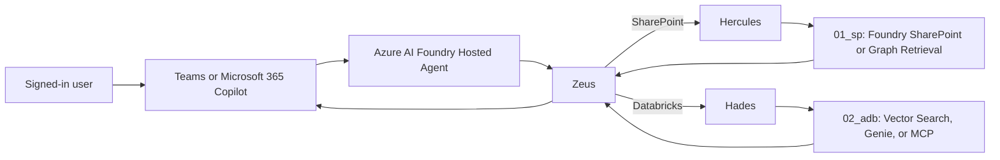

# Olympus Copilot SDK

Olympus is a governed, retrieval-grounded agent architecture for Azure AI Foundry, Microsoft
Teams, and Microsoft 365 Copilot. Zeus is the sole hosted entry point. It routes requests to
Hercules for SharePoint evidence, Hades for Databricks evidence, or both, then synthesizes only
from authorized evidence with stable request-local citations.

## Architecture



- `src/olympus_copilot_sdk/foundry`: dependency-free Zeus contract plus the Hosted Agent adapter,
  deterministic routing, identity binding, denial behavior, evidence normalization, Foundry
  Responses synthesis boundary, and citations.
- `src/olympus_copilot_sdk/channel`: Teams, Microsoft 365 Copilot, Foundry, OBO, consent, and
  restricted-document smoke-test configuration validation.
- `src/olympus_copilot_sdk/01_sp`: standalone SharePoint/Graph retrieval project. It forwards the
  caller's delegated identity and returns no evidence when source access is denied.
- `src/olympus_copilot_sdk/02_adb`: standalone Databricks project for Vector Search, Genie, or
  governed MCP under the `data.<source_schema>` Unity Catalog convention.
- `src/olympus_copilot_sdk/evaluation`: stack-neutral snapshots and deterministic quality metrics.
- `src/olympus_copilot_sdk/governance`: specialist receipt and AI registry validation.

Runtime capabilities stay package-owned in `tools.py`. Packages with several external operations
also maintain `tools.md`. There is no root tool registry.

## Security Boundaries

- Retrieved text, filenames, tool output, and specialist reports are untrusted data.
- SharePoint and Databricks remain the authorization authorities. Prompts and channel manifests do
  not grant access.
- Direct OBO requests require a complete delegated caller identity. Hosted requests require the
  platform user ID and opaque Foundry call ID. Both credential types are redacted and never passed
  to synthesis as evidence.
- The Foundry call ID is forwarded verbatim only to Foundry first-party services through
  `platform_headers()`. It is never parsed, trusted as a tenant claim, or used as a Graph,
  Databricks, or `Authorization` bearer token.
- A denied retrieval result cannot contain evidence, citations, metadata, or protected content.
- Placeholder configuration is valid only for static checks. It cannot be classified as
  authenticated evidence or promoted to an environment.
- Permissions, admin consent, channel publication, deployments, production identities, production
  data, dependencies, and governance changes require human approval.

## Configuration

Start with these placeholder artifacts:

- `src/olympus_copilot_sdk/channel/example_channel_config.json`
- `src/olympus_copilot_sdk/channel/example_teams_manifest.json`
- `src/olympus_copilot_sdk/channel/example_microsoft_365_copilot_manifest.json`
- `src/olympus_copilot_sdk/01_sp/configs/example.toml`
- `src/olympus_copilot_sdk/02_adb/configs/example.toml`

Values prefixed with `replace_me_` are intentionally unresolved. Do not commit credentials or
replace placeholders with production values without the required approval and secret-management
path.

## Hosted Agent Setup

### 1. Prerequisites

Obtain human approval for the target subscription, Foundry project, model deployment, managed
identity, network access, package versions, delegated permissions, channel publication, and data
connections. Install:

- Python 3.13 for the Hosted Agent runtime.
- Azure CLI and Azure Developer CLI (`azd`).
- The Microsoft Foundry extension for `azd` and, optionally, the Foundry Toolkit VS Code extension.
- Access to create or update a Foundry project and Hosted Agent.

Authenticate without storing credentials in the repository:

```bash
az login
azd auth login
```

### 2. Configure The Environment

Create a local file from `.env.example`; `.env` is ignored by Git. Select an approved catalog
model deployment and set exactly one deterministic Zeus route: `sharepoint`, `databricks`, `both`,
or `foundry`.

For a protocol-only check, keep this provider:

```text
OLYMPUS_DEPENDENCY_PROVIDER=olympus_copilot_sdk.foundry.providers:build_static_dependencies
```

It intentionally returns no evidence and never calls a model. It proves only that the Responses
server, Zeus entry point, route, and failure contract are wired. It is not an authenticated or
production retrieval provider.

An environment provider uses `module:function` and must return `HostDependencies`:

```python
def build_dependencies() -> HostDependencies:
    return HostDependencies(
        hercules=approved_sharepoint_retriever,
        hades=approved_databricks_retriever,
        synthesizer=FoundryResponsesSynthesizer(
            responses_client,
            model_deployment,
            current_platform_headers,
        ),
    )
```

Place the provider in an approved deployable package and set
`OLYMPUS_DEPENDENCY_PROVIDER=package.module:build_dependencies`. The current `01_sp` and `02_adb`
projects define typed retrieval contracts, but they do not contain approved live cloud HTTP
backends. Do not promote the static provider or claim live retrieval until those adapters exist.

The configured Foundry provider retrieves from the existing Azure AI Search indexes through
Hercules only:

```text
OLYMPUS_DEFAULT_ROUTE=foundry
OLYMPUS_DEPENDENCY_PROVIDER=olympus_copilot_sdk.foundry.providers:build_foundry_search_dependencies
AZURE_AI_SEARCH_ENDPOINT=https://aisearchagentic001d74afb.search.windows.net
AZURE_AI_SEARCH_INDEXES=ks-file-649-index,ks-file-960-index
```

It uses `DefaultAzureCredential` and does not accept Search admin or query keys. Grant the hosted
Foundry managed identity `Search Index Data Reader` at the Search service scope before deployment.

### 3. Identity And Retrieval Wiring

Responses protocol `2.0.0` supplies `x-agent-user-id` for in-container partitioning and
`x-agent-foundry-call-id` for per-request Foundry caller context. Zeus rejects a request when either
is absent.

For Foundry first-party storage, Toolbox, MCP, A2A, or model calls, merge only
`get_request_context().platform_headers()` into the outbound request. For direct Microsoft Graph or
Databricks OBO, obtain an approved delegated access token through the channel's authorization
flow. Never pass the Foundry call ID into the direct `01_sp` or `02_adb` access-token field.

The provider must preserve these outcomes:

- Authorized source: return normalized evidence with stable source ID and URI.
- Source denial: return `AccessDecision.DENIED` with no evidence or protected metadata.
- Empty authorized result: return allowed with no evidence; Zeus emits `insufficient_evidence`.
- Transient source failure: raise `RetryableHostError`; Zeus applies bounded retries.

### 4. Run Locally

The deployment dependencies are isolated in `requirements.txt`; the core `pyproject.toml` remains
runtime-dependency free. After dependency approval, create a Python 3.13 environment:

```bash
python3.13 -m venv .venv-hosted
source .venv-hosted/bin/activate
python -m pip install -r requirements.txt
set -a
source .env
set +a
python -m olympus_copilot_sdk.foundry.main
```

The server listens on the AgentServer port, normally `8088`. A local protocol test may supply
dummy platform headers, but those headers are client-controlled locally and are not authorization
evidence:

```bash
curl -sS -N http://localhost:8088/responses \
  -H 'Content-Type: application/json' \
  -H 'x-agent-user-id: local-static-user' \
  -H 'x-agent-foundry-call-id: local-static-call' \
  -d '{"model":"olympus-zeus","input":"Summarize authorized evidence","stream":true}'
```

With the static provider, the expected outcome is an explicit insufficient-evidence response with
no citation or model call.

### 5. Deploy With `azd`

The root `azure.yaml` deploys a Python 3.13 code-hosted agent using Responses protocol `2.0.0` and
the existing model deployment. Set the same non-secret values in the `azd` environment:

```bash
azd env new olympus-dev
azd env set AZURE_AI_MODEL_DEPLOYMENT_NAME 'gpt-5-mini'
azd env set AZURE_AI_SEARCH_ENDPOINT 'https://aisearchagentic001d74afb.search.windows.net'
azd env set AZURE_AI_SEARCH_INDEXES 'ks-file-649-index,ks-file-960-index'
azd env set OLYMPUS_DEFAULT_ROUTE 'foundry'
azd env set OLYMPUS_DEPENDENCY_PROVIDER \
  'olympus_copilot_sdk.foundry.providers:build_foundry_search_dependencies'
azd deploy
```

Review the generated resource plan before approving deployment. Foundry injects
`FOUNDRY_PROJECT_ENDPOINT` and platform request context in the hosted container. Do not add secrets
to `azure.yaml` or `azd` plain-text environment values; use approved connections or secret
references.

### 6. Connect Microsoft 365 Copilot

After the Hosted Agent endpoint passes authenticated checks, replace the placeholders in the
channel examples, configure the approved sign-in/OBO flow, validate the Teams and Microsoft 365
Copilot manifests, and obtain tenant admin consent for the reviewed delegated scopes. Publishing a
manifest does not grant source access and is not proof that OBO works.

## Promotion Checks

Run these in the deployed development environment before any higher promotion:

1. Invoke Zeus through Foundry and confirm no direct Hercules or Hades endpoint exists.
2. Confirm the selected deterministic route and exactly one synthesis call for answered requests.
3. Use an authorized SharePoint test user and verify stable PDF citations.
4. Use a denied test user and verify no restricted PDF title, filename, text, snippet, metadata,
   citation, cached answer, or download link is returned.
5. Exercise the selected Databricks Vector Search, Genie, or MCP strategy and verify Unity Catalog
   authorization and normalized citations.
6. Cancel an in-flight request and confirm no partial protected output is returned. The current beta
   hosting bridge propagates task cancellation but does not expose cooperative cancellation to
   `agent.run`; downstream calls must therefore have bounded timeouts.
7. Inspect traces for request stages, retries, failures, and usage without prompts, source content,
   user IDs, call IDs, or tokens in logs.

Record static, mocked, authenticated-development, and production evidence separately. Native
Agent Framework citation annotations are not currently relied upon; Olympus renders its stable
`[S#]` citation namespace in response text.

## Rollback And Cleanup

Keep the last approved Hosted Agent version available. If a smoke test fails, move traffic back to
that version in Foundry, revoke the failing channel publication or connection, and preserve
sanitized diagnostics. To remove a disposable development environment after approval:

```bash
azd down --purge
```

Do not delete shared projects, indexes, Unity Catalog objects, audit evidence, or production data
through this command without their owners' explicit approval and retention review.

## Local Validation

The root package has no runtime dependencies. Install only development tooling and run:

```bash
uv sync --extra dev --locked
uv run ruff format --check .
uv run ruff check .
uv run pyright
uv run pytest --cov-fail-under=70
uv run python -m olympus_copilot_sdk.governance.registry ai_registry
uv run bandit -c pyproject.toml -r src
uv run pip-audit
uv build
```

Validate the standalone cloud projects independently:

```bash
cd src/olympus_copilot_sdk/01_sp
uv sync --extra dev --locked
uv run pytest

cd ../02_adb
uv sync --extra dev --locked
uv run pytest
databricks bundle validate --target dev
```

The Databricks command requires the CLI, an authenticated workspace, approved resources, and an
environment identity. Local mocks do not establish cloud readiness.

## Smoke-Test Exit Criteria

1. Upload approved test PDFs to the configured SharePoint test library and preferred Azure AI
   Search path, or an approved Foundry file/vector store or Azure Blob source.
2. Deploy Zeus as a Foundry Hosted Agent and connect the approved Teams and Microsoft 365 Copilot
   manifests.
3. Verify OBO identity continuity with an authorized test user.
4. Verify a denied test user receives no restricted PDF title, filename, text, snippet, citation,
   metadata, cached answer, or download link.
5. Exercise Hades through the selected Databricks strategy and confirm normalized citations.
6. Record authenticated outcomes separately from static and mocked evidence.

Project-wide sign-off follows [the governance contract](docs/GOVERNANCE.md). Odin requires fresh
Loki, Thor, and Hela receipts and must preserve every condition.
